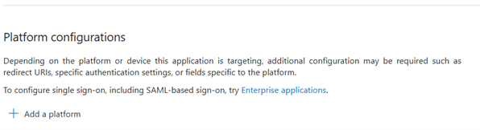
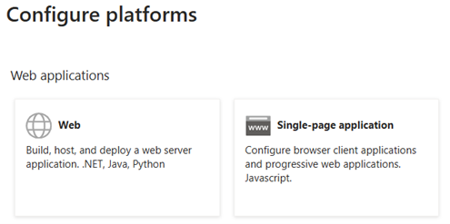
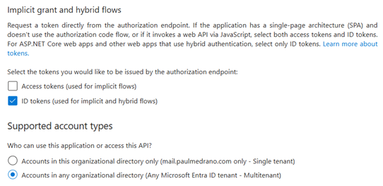
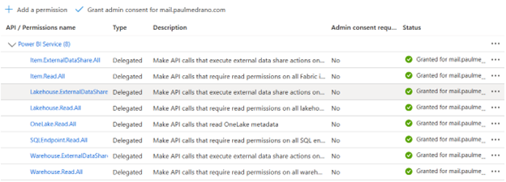

# How to Add and Use Cross-Tenant Service Principals in Fabric

## 1. Setting Up the Service Principal in Tenant A (Fabric Tenant)

### Step 1: Create an Enterprise Application
**A-** Open Azure Portal and navigate to Tenant A (where Fabric is hosted).  
**B-** Go to **Azure Active Directory > App Registrations**.  
**C-** Click **+ New Registration** to create a new Enterprise Application.

### Step 2: Configure Authentication
**A-** In App Registrations, locate the newly created application.  
**B-** Navigate to **Authentication** and click **Add a Platform**.  


**C-** On the next screen, select **Web**.  



**D-** Copy and paste the following **Redirect URI**:

```
https://login.microsoftonline.com/common/oauth2/nativeclient
```


**E-** Click **Configure**.  

Still within Authentication Scroll down and you will see the next:



Make sure you choose the options that you see on the screenshot. This should be all within Authentication.

### Step 3: Assign API Permissions

**A-** Go to **API permissions**.  
**B-** Click **Add a permission** and choose the necessary APIs.  
**C-** Ensure the following permissions are included:  


**D-** After adding permissions, click **Grant admin consent**.  
**E-** For security, consider removing unnecessary permissions, such as Item.Read.All, Lakehouse.Read.All, to minimize access. The unnecessary permissions will depend on what you are sharing or giving access to.

### Step 4: Create a Client Secret
Navigate to **Certificates & secrets**.  
Click **+ New client secret** and store the generated secret securely.  
You will not be able to retrieve it again.

### Step 5: Create a Security Group and Add the SPN
Go to **Microsoft Entra ID > Groups**.  
Click **+ New group**, and set the type to **Security**.  
Add the SPN as a member:  


---

## 2. Enabling Permissions in Fabric

Go to the **Fabric Admin Portal**.  
Navigate to **Admin settings** and enable the following:

- ✅ Service principals can use Fabric APIs  
- ✅ Service principals can access read-only admin APIs  
- ✅ Service principals can access admin APIs used for updates  

Add the security group created earlier to these permissions.  


---

## 3. Grant Access to the Fabric Workspace

In Fabric, navigate to the workspace where the Data Warehouse resides.  
Add the SPN as a **Viewer**:  


---

## 4. Registering the Service Principal in Tenant B

In Tenant B (ADF side), use the following URL to register the SPN from Tenant A:

```
https://login.microsoftonline.com/TENANT_B_ID/adminconsent?client_id=APP_CLIENT_ID
```

Replace:
- `TENANT_B_ID` with the tenant ID from Tenant B
- `APP_CLIENT_ID` with the client ID from the service principal in Tenant A

Accept the permissions prompt to finalize the setup.

---

## 5. Connecting from Azure Data Factory (ADF)

### Required Information:
- Tenant A ID
- Application (Client) ID
- SPN Client Secret

### Retrieve Fabric Workspace & Warehouse IDs

In Fabric, click **... > Copy SQL Endpoint** on the target Data Warehouse.  
The URL format will look like:

```
https://app.fabric.microsoft.com/groups/<workspace_ID>/warehouses/<warehouse_ID>
```

Use this information to build the ADF **Linked Service**:  


---

## ✅ Done!
Your cross-tenant integration is now ready using service principals between Azure Data Factory and Microsoft Fabric.
