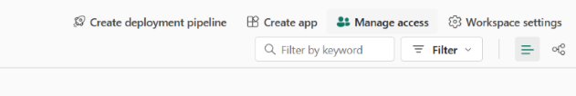
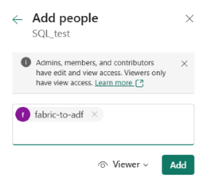

# How to Add and Use Cross-Tenant Service Principals in Fabric

## 1. Setting Up the Service Principal in Tenant A (Fabric Tenant)

### Step 1: Create an Enterprise Application
1.  Open Azure Portal and navigate to Tenant A (where Fabric is hosted).  
2.  Go to **Azure Active Directory > App Registrations**.  
3.  Click **+ New Registration** to create a new Enterprise Application.

### Step 2: Configure Authentication
1.  In App Registrations, locate the newly created application.  
2.  Navigate to **Authentication** and click **Add a Platform**.  


3.  On the next screen, select **Web**.  


4.  Copy and paste the following **Redirect URI**:

```
https://login.microsoftonline.com/common/oauth2/nativeclient
```


5.  Click **Configure**.  

Still within Authentication Scroll down and you will see the next:


Make sure you choose the options that you see on the screenshot. This should be all within Authentication.

### Step 3: Assign API Permissions

1.  Go to **API permissions**.
2.  Click **Add a permission** and choose the necessary APIs.
3.  Ensure the following permissions are included:


5.  After adding permissions, click **Grant admin consent**.
6.  For security, consider removing unnecessary permissions, such as Item.Read.All, Lakehouse.Read.All, to minimize access. The unnecessary permissions will depend on what you are sharing or giving access to.

### Step 4: Create a Client Secret
1.	Navigate to **Certificates & secrets**.
2.	Click **+ New client secret** and create a secret.
3.	**Store the secret securely** as it will not be visible after creation.


### Step 5: Create a Security Group and Add the SPN
1.	Go to **Microsoft Entra ID > Groups**.
2.	Click **+ New group**.
3.	**Group type** should be set to **Security**.
  


4.	Click on **No Members selected** and add the SPN to the security group.
---

## 2. Enabling Permissions in Fabric

1.  Go to the **Fabric Admin Portal**.  
2.  Navigate to **Admin settings** and enable the following:

- ✅ Service principals can use Fabric APIs  
- ✅ Service principals can access read-only admin APIs  
- ✅ Service principals can access admin APIs used for updates  

3.  Add the security group created earlier to these permissions.  


---

## 3. Grant Access to the Fabric Workspace

In Fabric, navigate to the workspace where the Data Warehouse resides.  
1.  Click on Manage access:




2.  Then click on **Add people or groups**:


3.  Add the SPN as a **Viewer**:



Make sure it is as viewer since it needs to have the ReadData permission which will let the Service Principal access the SQL endpoint.

You have also the option to share the specific Warehouse or Lakehouse SQL endpoint with the SPN.
1.  Still within the workspace where the Data Warehouse or Lakehouse is, click on the **share** button:


2.  Add the SPN and make sure to give it only the **Read all data using SQL** permission, like in the screenshot:


---

## 4. Registering the Service Principal in Tenant B

1.  In Tenant B (ADF side), use the following URL to register the SPN from Tenant A:

```
https://login.microsoftonline.com/TENANT_B_ID/adminconsent?client_id=APP_CLIENT_ID
```

Replace:
- `TENANT_B_ID` with the tenant ID from Tenant B
- `APP_CLIENT_ID` with the client ID from the service principal in Tenant A

2.  Accept the permissions prompt to finalize the setup.

---

## 5. Connecting from Azure Data Factory (ADF)

### Required Information:
- Tenant A ID
- Application (Client) ID
- SPN Client Secret


### Retrieve Fabric Workspace & Warehouse IDs

1.	In Fabric, go to the Data Warehouse.
2.	Click on the ... (More options) and select Copy SQL Endpoint.


3.	Extract the Workspace ID and the Warehouse ID from the Fabric URL:

```
https://app.fabric.microsoft.com/groups/<workspace_ID>/warehouses/<warehouse_ID>
```
Use this information to build the ADF **Linked Service**:  


---

## ✅ Done!
Your cross-tenant integration is now ready using service principals between Azure Data Factory and Microsoft Fabric.
